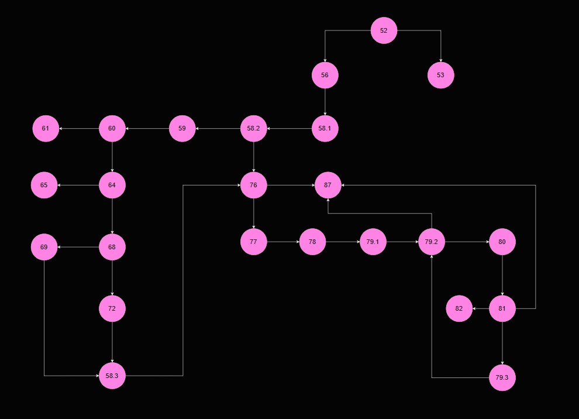

# SI_2025_lab2_233167
Ime: Ivana Prezime: Georgieva Indeks: 233167

Control Flow Graph:

Цикломатска комплексност:
Цикломатска комплексност се добива преку формулата P+1, каде P е бројот на предикатни јазли.
Во овој код P=8, па цикломатската комплексност е 8+1=9.

Тест случаи според критериумот Every statement:
(минимум 5 тест случаи)

| Тест случај | Опис                                                        | Резултат / Исклучок |
|------------|-------------------------------------------------------------|----------------------|
| TC1        | allItems == null                                            | `RuntimeException("allItems list can't be null!")` |
| TC2        | allItems = [], валиден cardNumber                           | sum = 0 |
| TC3        | item.name == null, валиден cardNumber                       | `RuntimeException("Invalid item!")` |
| TC4        | price > 300, discount == 0, quantity <= 10                  | sum = price * quantity - 30 |
| TC5        | discount > 0, невалиден cardNumber                          | `RuntimeException("Invalid character in card number!")` |

Тест случаи според критериумот Multiple Condition:
(item.getPrice() > 300 = A, item.getDiscount() > 0 = B, item.getQuantity() > 10 = C)

| Тест |   A   |   B   |   C   | Објаснување             |
|------|-------|-------|-------|--------------------------|
| TC1  | false | false | false | Не се исполнува условот |
| TC2  | false | false | true  | C е исполнет             |
| TC3  | false | true  | false | B е исполнет             |
| TC4  | false | true  | true  | B и C се исполнети       |
| TC5  | true  | false | false | A е исполнет             |
| TC6  | true  | false | true  | A и C се исполнети       |
| TC7  | true  | true  | false | A и B се исполнети       |
| TC8  | true  | true  | true  | Сите се исполнети        |

